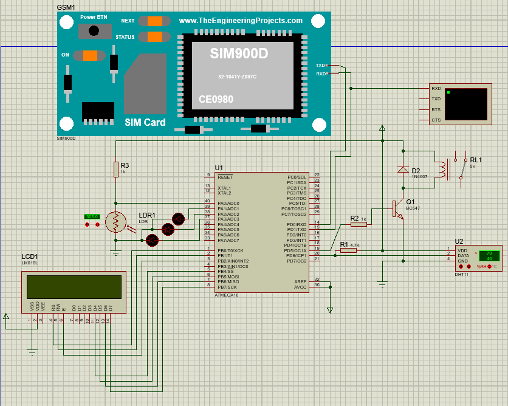

# Greenhouse Monitoring and Control System with AVR
Temperature and Humidity and Light Control with GSM  
CodeVision And Proteus  
<a href="https://www.theengineeringprojects.com/document/gsm-library-proteus/1">GSM Library</a>
## Microcontroller: 
ATmega16
## Sensors:
DHT11  
LDR  
Sim900D  

## schematic

